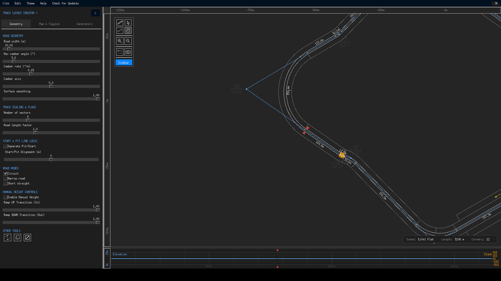
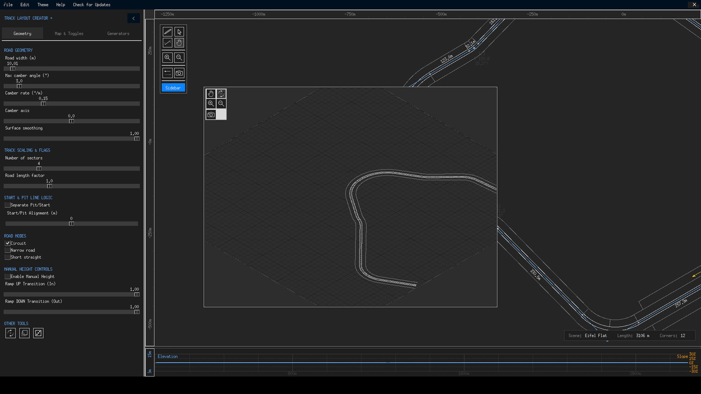

# Elevation & Terrain

TLC+ models elevation in three layers: a **real terrain heightmap** that follows the theme, **manual height nodes** that you sculpt, and **camber banking** that tilts the road across its width. The elevation graph at the bottom of the window is where all three become visible — and editable — at once.

{ class="tlc-shot" }

## The heightmap layer

Each theme ships a 1024 × 1024 heightmap of real terrain, sampled bilinearly whenever the road needs to know the ground's height:

| Theme | Coverage | Elevation range |
|---|---|---|
| **Eifel** | 12 000 × 12 000 m | −294.6 … +294.6 m |
| **Eifel Flat** | 12 000 × 12 000 m | −166.1 … +166.1 m |
| **Death Valley** | 6 000 × 6 000 m | −203.8 … +203.8 m |
| **Andalusia** | 7 000 × 7 000 m | −646 … +646 m |

Contours are drawn with a marching-squares algorithm; the interval follows the **Heightmap fidelity** slider (50 / 25 / 10 / 5 / 2.5 / 1 m from coarse to fine), with every fourth or fifth level emphasised and labelled in metres. During scrolling the interval temporarily coarsens so panning stays smooth, then snaps back.

The default theme, Eifel Flat, is deliberately gentle — its ±166 m of relief is forgiving to first layouts. Andalusia is the opposite: ±646 m of rugged Spanish terrain that will happily swallow a careless road.

## The elevation graph

The panel at the bottom of the window plots the track's height profile against distance:

- The **height curve** combines terrain heights with your manual heights, drawn along the track's own length in metres (see the left-hand ruler).
- The **slope curve** shows gradient in percent with gridlines at ±30 % — steeper than ±30 % and you are building a wall, not a road.
- **Distance markers** along the X axis keep you oriented; the vertical range always spans at least 10 m so flat tracks don't zoom into noise.

Click or drag in the graph to plant a **distance cursor**: a triangle appears on the graph *and* at the corresponding point on the track, and the main canvas centres itself there. It is the fastest way to answer "what exactly is happening at 2.4 km?" The cursor auto-hides after 2.5 seconds of inactivity; right-click clears it immediately. Drag the splitter above the graph to resize it — the height is remembered in `config.json`.

## Manual heights

Tick **Enable Manual Height** (Geometry tab) and every node's Z becomes an editable property:

1. Double-click a node (or press ++enter++ with it selected).
2. Set **Z (Height m)** — positive is up.
3. Watch the profile update instantly.

Manual heights are *blended on top of* the terrain rather than replacing it. The exporter first samples and smooths the terrain profile, then applies your manual heights with easing so the road never develops kinks. Two sliders shape that easing:

- **Ramp UP Transition (In)** — the fraction of the segment *before* the node spent ramping up to its height.
- **Ramp DOWN Transition (Out)** — the fraction *after* the node spent ramping away.

Both default to 1.0 (the whole segment eases); with **Smooth Elevation Graph** enabled (Map & Toggles tab) the easing is a smoothstep curve, and the graph's plotted line uses a moving-average smoothing as well. The practical effect of the two sliders is concentrated versus gradual height events: low ramp values produce sharp crests and compressed dips, while high values stretch changes into long, flowing waves.

!!! tip "Crests that read well from the cockpit"
    For a visible but drivable crest: give a node on a straight +6 to +10 m of manual height with ramps around 0.4–0.6. The climb and fall each take less than half a segment, creating a proper blind crest instead of a gentle swell.

## Surface smoothing

The **Surface smoothing** slider on the Geometry tab (0–1, default 1) blends between raw terrain heights and a smoothed version of them. The exporter's smoothing pass segments the terrain profile by slope and rounds the joints with Hermite splines — meaning hills keep their shape but instrument-quivering micro-noise disappears. Set it toward 0 if you *want* the road to chatter over every contour bump (authentic tarmac ripple, at some risk of geometry jitter), or keep it at 1 for the cleanest driving surface.

## Banking interaction

Camber banking adds a vertical component of its own: the road tilts across its width, pivoting around the **camber axis** (inner edge / centre / outer edge). In the exported geometry this banking contributes to heights along the road edges — that is why a cambered hairpin on the outer-edge axis can sit visibly higher than the same corner banked on its inner edge. The full banking model is described in [Track Geometry → Camber](track-geometry.md#camber).

## Theme-specific elevation notes

- Switching themes via the **Theme** menu reloads the heightmap and re-samples everything — your polygon stays, but a road that hugged Andalusian cliffs may suddenly float above (or sink into) Eifel Flat meadows. Re-check the profile after every theme switch.
- The elevation graph always reflects the *current* theme, including manual heights and their easing.
- Isometric view (**File → Draw isometric view**) renders the same terrain data in 3D and is the quickest sanity check that your road hasn't tunnelled through a hillside.

{ class="tlc-shot" }
