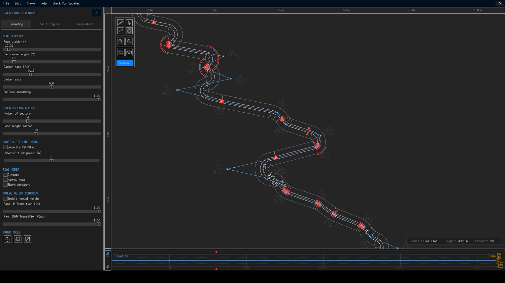
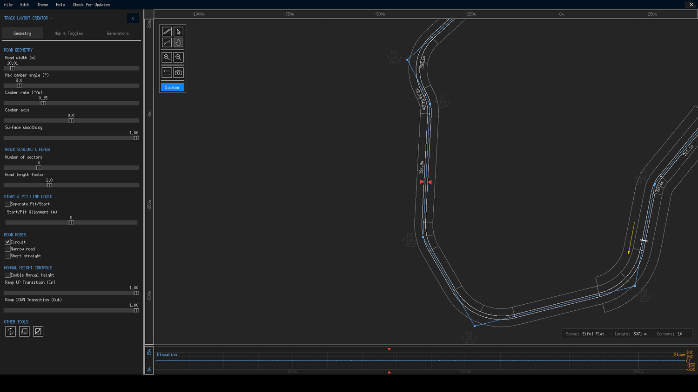

# Procedural Builder

The Procedural Track Builder creates complete layouts from mathematical recipes — one button per archetype, a fresh roll of the dice every click. Generation is instant and entirely local: nodes are placed by geometric rules, radii assigned from each archetype's profile, the view recentres, and an undo snapshot means ++ctrl+z++ puts your previous track back exactly as it was.

All five generators share the same contract: every node is created with zero height, *global* camber and circular curve mode (segments = 1), circuit mode is set appropriately for the style, and the result is a fully editable polygon — nothing about a generated track is locked or special.

## The five archetypes

### Grand Prix (Fast & Flowing)

**12–18 nodes across a 600 × 400 m envelope, corner radii 40–140 m scaled by distance from centre, irregularity 0.6, plus ±50 m of position noise.** The recipe aims for the classic GP rhythm: long straights into wide, fast corners, with radius scaled up toward the layout's edges (where speeds are higher) and tightened near the centre. This is the archetype to click when you want a believable "somewhere in Europe" circuit that needs polish rather than surgery.

{ class="tlc-shot" }

### Technical / Karting (Twisty)

**18–26 nodes packed into 300 × 300 m, radii 20–60 m, irregularity 0.3.** Constant direction changes with tight radii — think karting tracks and street circuits. The low irregularity keeps the layout coherent while the sheer node density delivers the twist. Pairs naturally with **Narrow road** mode and a 6–8 m road width on the Geometry tab.

### Oval / Speedway (4-Turn)

**Exactly 4 nodes on a 700 × 300 m stretched shape, radii 100–200 m, start angle rotated 45°, zero noise.** The only archetype with a fixed node count — a true speedway: two long straights, two wide turns. Everything is deterministic in shape but the radii still vary within their range, so ovals range from paperclip-parallel to D-shaped.

### Rally Stage (Point-to-Point)

**38–55 nodes on a north–south run from y = −1100 m to +1100 m, the x coordinate performing a random walk of ±250 m per step clamped to ±1000 m, radii uniform 35–90 m.** The result is a 2.2 km point-to-point stage of linked sweepers — and the only archetype that is *not* a circuit. Two rules protect its integrity:

1. Generating a rally stage while **Circuit** is checked is blocked with an explanatory dialog — unless the experimental override in [Preferences](../interface/preferences.md) is enabled (the result is then slightly broken, at your own risk).
2. On success, circuit mode is switched **off** automatically.

Rally stages are also the natural home of the **Short straight** road mode: a single sprint-start block instead of the full circuit start zone.

{ class="tlc-shot" }

### Abstract / Chaos (Random)

**8–30 nodes in a 500 × 500 m box, radii anywhere from 10 m to 150 m, irregularity 0.8, ±50 m noise.** No pretence at realism — a pure idea generator. One roll gives a kidney bean, the next a pretzel. Treat it as a sketching tool: click until a fragment catches your eye, then delete everything else and build around that seed.

{ class="tlc-shot" }

## Using generators as *seeds*

Experienced builders rarely ship a raw generation. The productive pattern is:

1. **Roll** the closest archetype a few times; keep the best bones.
2. **Prune** — delete nodes that add nothing (Shift-click with the pen tool).
3. **Relocate** — drag and rotate the fragments worth keeping; scale tool for overall size.
4. **Re-radius** — right-drag corners to taste; press ++e++ to give important corners Euler curvature.
5. **Localize** — move the whole polygon into interesting terrain, then sculpt elevation with manual heights.
6. **Polish** — enable corner number labels, walk the lap, and fix every warning the canvas shows you.

Because generated nodes are ordinary nodes, every subsequent step uses the exact same tools as a hand-drawn track — there is no "generated" state to undo or escape.

!!! tip "Mixing archetypes"
    Nothing stops you from generating an oval, deleting two straights, then generating a Technical track and copy-… well, copying nodes between tracks isn't directly supported — but exporting both as `.pgn` and merging them in a text editor is, and Import polygon brings the hybrid back. For less extreme mixes, simply generate one archetype and hand-build the rest around it.
