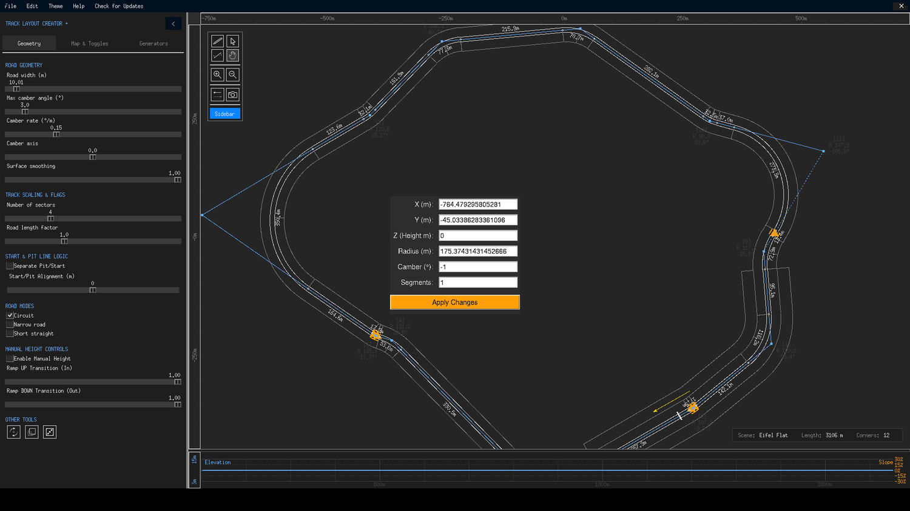

# Your First Track

This walkthrough takes you from a fresh install to an exported, GT6-ready `.ted` file in about five minutes. Along the way you will touch every part of the interface once — the generators, the pen tool, the sidebar controls and the export dialog — so you have a mental map of the app before diving into the details.

{ class="tlc-shot" }

## Step 1 — Generate a starting point

You could place every corner by hand, but it is much more fun to start from a machine-made layout:

1. Click the **Generators** tab on the left sidebar.
2. Click **Grand Prix (Fast & Flowing)**.

Within a moment the canvas fills with a closed circuit: blue control nodes connected by a grey control polygon, the smooth road drawn along it, index labels next to every node and an elevation profile at the bottom of the window. The status card in the lower-right corner shows the theme, the track length and the number of corners. Every click of the button rolls a new random layout — press it a few times until you like the bones of the track.

!!! tip "Starting from scratch instead"
    If you want to draw a track from a paper sketch or an image, skip the generator and read the [Image Vectorizer](../generators/image-vectorizer.md) page. To place points manually, select the **Pen tool** from the toolbar and click on the canvas.

## Step 2 — Get comfortable in the canvas

Spend a minute practising navigation before editing anything:

- **Scroll wheel** — zoom in and out, centred on the mouse cursor.
- **Right-click and drag** — pan the view (works with any tool active).
- ++c++ — centre the view on the whole track.

Select the **Selection tool** (the arrow icon at the top-left of the canvas) and click a control node. The node turns orange and a pair of small dots appear flanking the corner — these are the Euler handles. Drag the node itself to move the corner, or drag the flanking dots to change how sharply the corner rounds off.

For numeric precision, double-click any node (or select it and press ++enter++) to open the **Edit Point** dialog, where you can type exact X/Y coordinates, a height, a corner radius, camber and the number of curve segments.

{ class="tlc-shot" }

## Step 3 — Tune the road

Switch to the **Geometry** tab and adjust the sliders that shape the whole track. The two you will feel immediately are:

- **Road width (m)** — the drawn and exported width of the tarmac. The minimum corner radius automatically adapts so hairpins cannot become geometrically impossible.
- **Max camber angle (°)** — the upper limit for automatic banking applied to corners. Higher values produce more visibly banked bends in the isometric view.

Further down the same tab you will find **Road Modes**. Leave **Circuit** checked for now — it keeps the loop closed and enables start/pit line logic. If you were building a point-to-point sprint or rally stage instead, you would uncheck it.

## Step 4 — Add some elevation

Tracks on a billiard table feel lifeless, so give yours some vertical interest:

1. On the **Geometry** tab, in **MANUAL HEIGHT CONTROLS**, tick **Enable Manual Height**.
2. Double-click a node on a straight and give it a positive **Z (Height m)** value — say `12`.
3. Double-click a node further along the track and set it to `-4`.

The elevation profile at the bottom of the window immediately shows the crest and dip, with the road smoothly easing between your height nodes. The **Ramp UP/DOWN Transition** sliders control what fraction of each segment is used for the ease-in and ease-out; the graph's smoothstep easing can be disabled with the **Smooth Elevation Graph** toggle on the *Map & Toggles* tab if you prefer linear ramps.

!!! info
    Even without manual heights, the road already follows the real terrain of the active theme. Manual heights are *offsets blended on top of* the terrain profile — see [Elevation & Terrain](../concepts/elevation-terrain.md) for the full model.

## Step 5 — Save your work

Press ++ctrl+s++ (or **File → Save track**). TLC+ writes a `.trk5` file into the `savefiles/` folder, named with the current date and time, for example `20260826_154200.trk5`. The file contains the entire project — polygon, per-node radii and heights, and all sidebar settings — so you can reopen it later with ++ctrl+o++ and continue exactly where you left off.

Saving early and often is worthwhile because the undo history (and everything else) lives only in memory: closing the app without saving discards the current session.

## Step 6 — Export to TED

When the layout feels right, export it for *Gran Turismo 6*:

1. Choose **File → Export to TED** (there is no keyboard shortcut for this one).
2. Pick a location — the default is the `output/` folder — and confirm.

TLC+ now computes the final geometry: it rounds the corners, resamples the road into segments, spreads banking transitions, generates checkpoints every full 1000 m, and writes the 156-byte TED header GT6 expects, including the 3D track length, elevation difference and corner count. You need at least two control points (three when Circuit mode is on) before an export is possible.

The resulting `.ted` can be loaded by the official **GT6 Track Path Editor** on a PS3, where it can be shared or driven. For everything that happens during the export — including the PS3 crash guard that removes sub-0.1 m road segments — see the [Exporting](../files/exporting.md) page.

## Step 7 — Take a victory lap

Before you close the app, treat yourself to a 3D preview: **File → Draw isometric view** opens an isometric rendering window of your track with its terrain. Drag to rotate the camera, scroll to zoom, press ++r++ to reset the view — and if you like what you see, use the toolbar's camera button (or **File → Export to PostScript**) to save a vector screenshot to `img/screen.ps`.

{ class="tlc-shot" }

---

## Where to go from here

You have now used every major area of TLC+. The rest of this guide goes deep on each of them:

- **[Window Overview](../interface/overview.md)** — names and locations of every UI element.
- **[Toolbar & Canvas Tools](../interface/toolbar.md)** — complete mouse and keyboard reference.
- **[Track Geometry](../concepts/track-geometry.md)** — how corners, radii, camber and Euler curves really work.
- **[Files & Data](../files/saving-loading.md)** — every format TLC+ reads and writes.
- **[Tips & Techniques](../tips.md)** — workflows used by experienced track builders.
