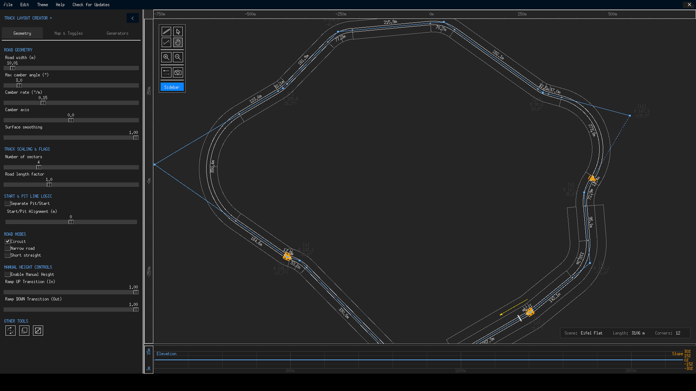

# Track Layout Creator + Guide

**Track Layout Creator +** (TLC+) is a free, open-source desktop track layout editor for designing, generating and exporting race track layouts as `.ted` files — the track format used by the **Track Path Editor** in *Gran Turismo 6*. Built with Python and Tkinter, it combines a precise node-based polygon editor with mathematical track generation, image vectorization, real terrain data and a built-in elevation editor.

[Getting started :material-arrow-right:](getting-started/installation.md){ .md-button .md-button--primary }
[Create your first track](getting-started/first-track.md){ .md-button }

{ class="tlc-shot" }
*(TLC+ v1.2.0 with a procedurally generated Grand Prix circuit on the Eifel Flat theme)*

---

## What can you do with it?

### :fontawesome-solid-pen-ruler&nbsp; Design tracks by hand

Place, drag and fine-tune control points on a zoomable canvas with Euler-spiral and circular corner interpolation, per-corner radii and camber, and live measurements of track length and corner count. A precision dialog lets you type exact coordinates, heights and radii for every node.

### :fontawesome-solid-wand-magic-sparkles&nbsp; Generate tracks mathematically

One-click procedural generators produce complete layouts in five flavours — Grand Prix, Technical/Karting, Oval/Speedway, Rally Stage and Abstract/Chaos — each with its own character, scale and corner profile. See [Procedural Builder](generators/procedural.md).

### :fontawesome-solid-image&nbsp; Trace tracks from pictures

The built-in [Image Vectorizer](generators/image-vectorizer.md) converts a PNG, JPG, WebP, BMP or GIF of a track map into an editable polygon using centerline extraction, outline tracing or a smart travelling-salesman fill — ideal for recreating real circuits.

### :fontawesome-solid-mountain-sun&nbsp; Sculpt elevation with real terrain

Four heightmap themes — Eifel, Eifel Flat, Death Valley and Andalusia — provide real-world terrain data with contour rendering, an interactive elevation profile graph and manual height nodes for jumps, crests and dips. See [Elevation & Terrain](concepts/elevation-terrain.md).

### :fontawesome-solid-file-export&nbsp; Export for Gran Turismo 6

TLC+ writes `.ted` files compatible with the official GT6 Track Path Editor, including banking, per-1000 m checkpoints, pit and start line placement, and several PS3-specific safety fixes. It also exports PostScript vector screenshots and `.pgn` polygon data.

### :material-translate&nbsp; Nine interface languages

The app ships with English, Polish, Spanish, Portuguese (BR/PT), French, German, Japanese and Russian translations — and this guide can be machine-translated into any language with the **Translate** button in the header.

---

## Where to go next?

-   :material-download:&nbsp; **[Installation](getting-started/installation.md)**

    ---
 
    Set up TLC+ on Windows, macOS or Linux in under two minutes.

-   :material-flag-outline:&nbsp; **[Your First Track](getting-started/first-track.md)**

    ---
 
    A five-minute walkthrough from empty canvas to exported `.ted` file.

-   :material-dock-window:&nbsp; **[Window Overview](interface/overview.md)**

    ---
 
    A guided tour of the toolbar, sidebar, canvas, elevation graph and status card.

-   :material-keyboard:&nbsp; **[Toolbar & Canvas Tools](interface/toolbar.md)**

    ---
 
    Every tool explained — pen, selection, camber, pan, rotate, scale and more.

-   :material-content-save:&nbsp; **[Files & Data](files/saving-loading.md)**

    ---
 
    Save formats, imports (GPX, CSV, TED) and GT6-ready exports.

-   :material-help-circle-outline:&nbsp; **[FAQ](faq.md)**

    ---
 
    Answers to the most common questions and troubleshooting tips.

---

## About the project

Track Layout Creator + is a community enhancement of the original **Track Layout Creator** by **eran0004** (GTPlanet). Version 1.2 and the "Plus" feature set — GPX/CSV import, high-DPI scaling, the modern dark theme, start/finish line fixes and the procedural math builders — were contributed by **daydrive7** with additional community input.

- **Current version:** 1.2.0 (August 2026)
- **License:** MIT — free to use, modify and redistribute
- **Platform:** Windows, macOS and Linux (Python 3.8+)
- **Source code:** [github.com/daydrive7/track-layout-creator-plus](https://github.com/daydrive7/track-layout-creator-plus)

If you find a bug or have an idea for a feature, the project welcomes contributions — see the `CONTRIBUTING.md` file in the repository for guidelines.
