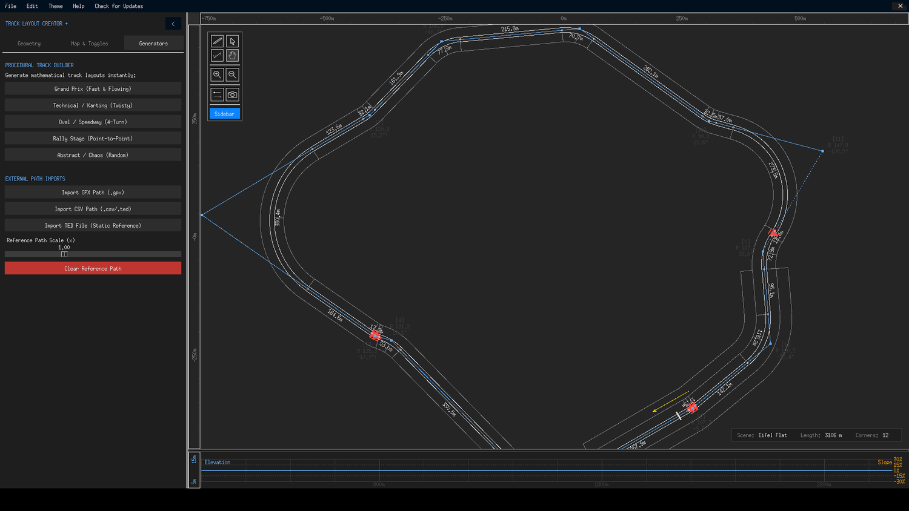

# Generators Tab

The third sidebar tab contains TLC+'s three "bring data in" sections: the procedural track builder, the image vectorizer and external path imports. Which of them are visible at all is configurable in [Preferences](preferences.md) — hide the ones you never use and the tab stays tidy.

{ class="tlc-shot" }

## Procedural Track Builder

> Generate mathematical track layouts instantly.

Five one-click buttons, one per archetype. Each press rolls a fresh random layout within the archetype's character — the previous polygon is replaced (undo works, as always), the view recentres, and circuit mode is set appropriately for the style. The complete parameter table, per-archetype behaviour and design notes live on the [Procedural Builder](../generators/procedural.md) page.

| Archetype | One-liner |
|---|---|
| **Grand Prix (Fast & Flowing)** | Large 12–18 node circuit mixing long straights with sweeping corners |
| **Technical / Karting (Twisty)** | Compact 18–26 node layout of tight, constant corners |
| **Oval / Speedway (4-Turn)** | Classic stretched 4-node oval with wide turns |
| **Rally Stage (Point-to-Point)** | Long 38–55 node sprint winding 2.2 km north-to-south |
| **Abstract / Chaos (Random)** | Anything from 8 to 30 nodes of unapologetic randomness |

## Image Vectorizer

> Trace a track layout from a PNG/GIF image using advanced algorithms.

Pick one of three trace modes, press **Trace Image**, and choose a picture — the resulting polygon lands on the canvas, editable like any hand-drawn track.

- **Centerline (Drivable)** *(default)* — extracts the drivable middle line of a drawn track; the recommended mode for track maps and screenshots.
- **Outline (Shape)** — traces the outer boundary of the shape; best for silhouette-style inputs.
- **Smart Fill (TSP)** — sub-samples the ink and chains the points with a travelling-salesman heuristic; the fallback for dense or unusual imagery.

Despite the section description mentioning PNG/GIF, the file dialog accepts **PNG, JPG, JPEG, WebP, BMP and GIF**. The full pipeline — thresholding, skeletonization, the RDP simplification, scale normalization and the error cases — is documented on the [Image Vectorizer](../generators/image-vectorizer.md) page.

## External Path Imports

Three buttons plus one slider for bringing real-world data in as a **reference path** — a non-editable overlay you can trace over with the pen:

- **Import GPX Path (.gpx)** — reads waypoints from a GPS exchange file and projects them (azimuthal equidistant, centred on the track's bounding box) into metres on the canvas.
- **Import CSV Path (.csv/.ted)** — reads a CSV with `lat`/`lon` (or `latitude`/`longitude`) columns; despite the button's label, the picker filters for CSV files.
- **Import TED File (Static Reference)** — draws the centreline of an existing TED as an overlay. To turn a TED into an *editable* polygon instead, use **File → Import TED**, which reverse-engineers editable corner nodes (see [Importing](../files/importing.md)).

The **Reference Path Scale (×)** slider (0.01 – 3.00, default 1.00) resizes the overlay about its own centre — use it when your GPX was recorded on a different scale than you want to build at, or to shrink a huge real-world loop down to GT6-friendly dimensions.

Imported references are drawn in a distinct colour so they never blend into your own polygon, and they are covered by the **Reference Path** display toggle on the [Map & Toggles tab](map-toggles-tab.md). The dark-red **Clear Reference Path** button removes the overlay completely.

!!! tip "Classic workflow: trace a real circuit"
    1. Export a real circuit from OpenStreetMap as GPX (many converters exist).
    2. Import it here as a reference.
    3. Scale it so the straights match your target dimensions.
    4. Pen-tool over it node by node, then clear the reference.
    You end up with a clean, editable approximation of a real track — with elevation from the theme of your choice.
