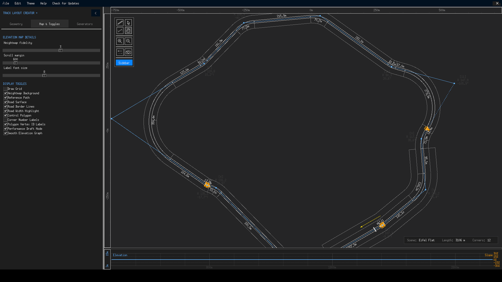
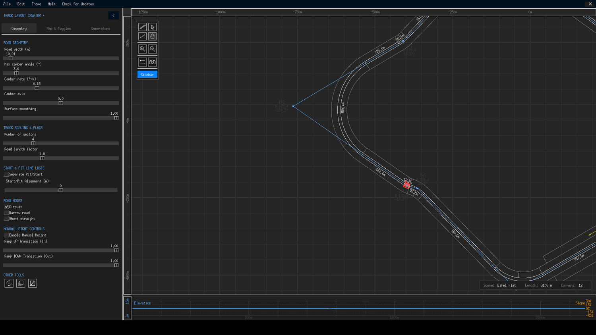

# Map & Toggles Tab

The second sidebar tab controls *how the map and your track are rendered* — it never changes the track itself, only what you see. Its two sections cover elevation-map display details and eleven display toggles. Use this tab to declutter the canvas while sketching, then switch everything back on for a final review.

{ class="tlc-shot" }

## Elevation Map Details

| Control | Range | Default | What it does |
|---|---|---|---|
| **Heightmap fidelity** | 0 – 5 | 3 | The contour interval drawn on the terrain: levels correspond to 50 / 25 / 10 / 5 / 2.5 / 1 m steps. Higher fidelity = denser contour lines and more elevation labels. |
| **Scroll margin** | 0 – 5000, step 200 | 600 | How far (in metres) you can pan beyond the edge of the map before hitting the wall. Larger margins make wide touring easier. |
| **Label font size** | 5 – 12 | 8 | Pixel size of contour and corner labels. Corner-count labels scale proportionally. Bump this up on high-DPI displays if labels feel small. |

A note on performance: while you scroll or zoom, the renderer automatically drops to coarser contours for a fraction of a second and restores your chosen fidelity when the view settles. This happens regardless of the Performance Draft Mode toggle below — it is a hard-coded guard that keeps interaction smooth on the denser heightmaps.

{ class="tlc-shot" }

## Display Toggles

Each toggle shows or hides one layer of the rendering. Defaults are chosen for a good first impression; the table notes which layers most builders turn off while working.

| Toggle | Default | Layer |
|---|---|---|
| **Draw Grid** | :material-checkbox-blank-outline: | Metric grid over the terrain — invaluable for measuring straight lengths by eye. |
| **Heightmap Background** | :material-checkbox-marked: | The terrain itself, with contours. Turn off for a flat dark drafting surface. |
| **Reference Path** | :material-checkbox-marked: | The imported GPX/CSV/TED reference overlay, when one is loaded. |
| **Road Surface** | :material-checkbox-marked: | The filled road ribbon. |
| **Road Border Lines** | :material-checkbox-marked: | Outline strokes along the road edges. |
| **Road Width Highlight** | :material-checkbox-marked: | The visual indication of the drivable width inside the borders. |
| **Control Polygon** | :material-checkbox-marked: | The blue node-and-line skeleton that *is* your editable geometry. |
| **Corner Number Labels** | :material-checkbox-blank-outline: | Numbered tags on each corner — enable to check corner counts and sequence like a real circuit map. |
| **Polygon Vertex ID Labels** | :material-checkbox-marked: | Index numbers on every control node, matching the `Edit Point [n]` dialog. |
| **Performance Draft Mode** | :material-checkbox-marked: | Simplifies labels and contours during interaction so drags stay responsive. Disable for max fidelity while recording or reviewing. |
| **Smooth Elevation Graph** | :material-checkbox-marked: | Applies smoothstep easing to manual heights in the profile graph (and in exports). Uncheck for linear ramps. |

### Suggested workspace presets

- **Sketching layout** — Heightmap Background off, Grid on, Corner Labels off, Width Highlight off. A quiet canvas where the polygon is king.
- **Elevation work** — everything on, fidelity 4–5, label size up. You want every contour visible when sculpting crests.
- **Final review** — Control Polygon off, Corner Labels on, Draft Mode off. See the track the way a driver (or the exporter) will.

!!! info "Toggles don't change the export"
    Every toggle here is purely visual. Turning off the road surface does not remove the road from the TED file, and turning off contour lines does not flatten terrain. What you export is always the full geometry you have built.
