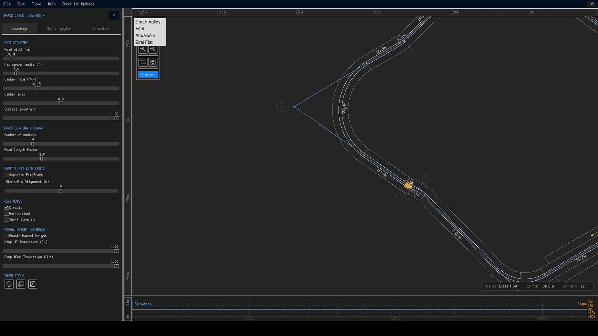

# Window Overview

TLC+ uses a single maximized window with a custom dark title bar. Everything you need is visible at once — no hidden palettes, no floating dialogs except when deliberately opened. This page names each region of the window so the rest of the guide can refer to them precisely.

{ class="tlc-shot" }

## Title bar

The slim bar along the top edge replaces the native window frame. From left to right you will find:

- **TRACK LAYOUT CREATOR +** — the app name, always visible.
- **File / Edit / Theme / Help** — dropdown menus (details below).
- **Check for Updates** — opens the release page after confirming internet use.
- **— / ▢ / ✕** — minimize, maximize (double-clicking the bar also toggles it) and close. Closing via ✕ saves your preferences; the File → Quit entry does not.

Because the window is frameless, you move it by dragging the empty area of the title bar, and resize it from any edge or corner — hover near a border until the resize cursor appears.

!!! note "Auto-dismissing menus"
    Opened menus close themselves 200 ms after the mouse pointer leaves them, which keeps the UI feeling light. Click a menu button again to cancel one immediately.

### Menus at a glance

| Menu | Entries |
|---|---|
| **File** | Load track, Save track, Import/Export polygon, Import TED, Export to TED, Export to PostScript, Draw isometric view, Preferences, Language, Quit |
| **Edit** | Undo, Redo |
| **Theme** | Death Valley, Eifel, Andalusia, Eifel Flat |
| **Help** | Guide (opens this wiki), Controls (in-app reference card), Credits |

{ class="tlc-shot" }

## Toolbar

The vertical strip floating over the canvas at the top-left holds the interaction tools: selection, pen, camber and pan (mutually exclusive), plus zoom in/out, reverse direction, screenshot, and at its bottom the button that shows or hides the whole sidebar. The full behaviour of every tool — including the mouse gestures each one responds to — is covered in [Toolbar & Canvas Tools](toolbar.md).

## Canvas

The main drawing area fills the window. It renders, from back to front:

1. **Terrain heightmap background** of the active theme, with topographic contour lines and elevation labels.
2. **Optional reference path** — an imported GPX/CSV/TED overlay drawn as guidance.
3. **The track** — control polygon, corner radii, smooth road surface with border lines and width highlight, corner numbers, and start/pit markers (a magenta pit lane with a PIT START tag appears for offset circuits).
4. **Warnings** — blinking triangle markers where geometry may cause problems (see below).

Zoom is anchored to the mouse cursor with the scroll wheel, so the point under the pointer stays put while you zoom — essential for detail work. During scrolling, the renderer temporarily switches to a simplified draft mode so panning stays fluid even with dense contour lines.

### Canvas warnings

Two kinds of problems are drawn directly on the canvas, blinking between red and orange every 600 ms so they cannot be missed:

- A **triangle marker** on a straight or corner that is shorter than 14 m — GT6 Track Path Editor struggles with microscopic features.
- A marked **centre point** on a corner whose radius is smaller than half the road border width — the road would self-intersect at the apex.

Additionally, a corner's label gains an exclamation mark when its sweep angle is very sharp relative to its radius. Fixing any of these is usually just a matter of moving nodes apart, increasing the radius, or trimming nearby points.

## Sidebar

The panel on the left (300 px wide on large screens, auto-narrowed on smaller ones; resizable by dragging the divider, collapsible via the arrow in its header) organises all track settings into three tabs:

- **Geometry** — road dimensions, corner camber, track scaling & flags, start/pit line logic, road modes, manual height controls and the rotate/scale/randomize tools.
- **Map & Toggles** — elevation map details (fidelity, scroll margin, label size) and eleven display toggles.
- **Generators** — the procedural track builder, the image vectorizer and external path imports.

Each tab is documented on its own page: [Geometry Tab](geometry-tab.md), [Map & Toggles Tab](map-toggles-tab.md) and [Generators Tab](generators-tab.md). Which generator sections appear at all is controlled from [Preferences](preferences.md).

## Elevation graph

The strip along the bottom of the window is the elevation profile of your track: terrain height and manual height as curves, a slope percentage graph with ±30 % gridlines, and distance markers along the X axis. Click anywhere in it to plant a distance cursor — a triangle pair appears both on the graph and on the track itself, and the canvas centres on that spot — handy for finding "that crest around 2.4 km". Right-click to clear the cursor; indicators fade automatically after 2.5 seconds. The panel's height can be adjusted by dragging the splitter above it, and the setting is remembered between sessions.

## Status card

The floating card in the bottom-right corner of the canvas reports three live values:

| Field | Meaning |
|---|---|
| **Scene** | Active heightmap theme (Eifel Flat by default) |
| **Length** | Plan-view (2D) length of the smoothed centreline, rounded to whole metres |
| **Corners** | Number of rounded curves in the finished track |

Note that the *exported* TED header stores the 3D length — including every metre climbed and descended — so it can read slightly higher than this plan-view figure when your track has significant elevation.

## Dialogs

TLC+ keeps dialogs to a minimum: the **Edit Point** precision editor, the **Preferences** module manager, the in-app **Controls** reference, **Credits**, and the isometric viewer. All of them are centred on screen and can be closed with their buttons or by destroying them like any normal window; the app itself keeps running underneath.

{ class="tlc-shot" }
