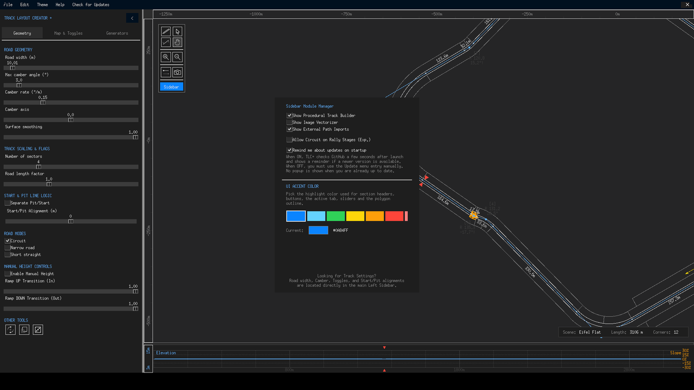
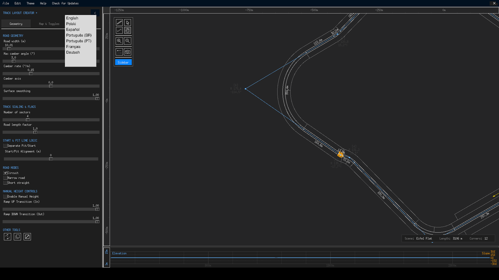

# Preferences

**File → Preferences** opens the *Sidebar Module Manager*, TLC+'s settings dialog — 400 × 540 pixels of checkboxes and colour swatches that configure what the app shows and how it behaves. Settings apply immediately and are persisted to `config.json` in the application folder; a few take effect on next launch.

{ class="tlc-shot" }

## Sidebar modules

The first three checkboxes control which sections of the [Generators tab](generators-tab.md) exist at all:

| Module | Default | Effect |
|---|---|---|
| **Show Procedural Track Builder** | :material-checkbox-marked: | The five mathematical generators. |
| **Show Image Vectorizer** | :material-checkbox-blank-outline: | The image-tracing section — off by default because most tracks don't start from a picture. |
| **Show External Path Imports** | :material-checkbox-marked: | GPX/CSV/TED reference imports. |

Sections reappear in a fixed order no matter in which sequence you toggle them, so the tab's layout never surprises you. Hiding a module does not uninstall anything — flipping the checkbox back restores it exactly.

## Experimental overrides

**Allow Circuit on Rally Stages (Exp.)** — default off — removes the safety check that blocks rally generation while Circuit mode is enabled. When you enable it, the app asks for explicit confirmation and warns that the resulting generation is *slightly broken*: rally stages are point-to-point by construction, and forcing circuit logic onto them produces start/pit geometry that GT6 was never meant to see. It exists for experimentation, not production tracks.

## Updates

**Remind me about updates on startup** — default on — lets the app phone home (GitHub, 12-second timeout) about five seconds after launch to compare version numbers. The check is silent: you are notified at most *once per new version*, and never again for that version. The sidecar file `.tlcp_update_state.json` next to the program remembers what you have already been told. The manual **Check for Updates** button in the title bar always asks before using the network, and neither path ever downloads or installs anything automatically — both simply open the release page in your browser when a newer version exists.

## UI Accent Colour

Eight preset accent colours plus a custom picker:

| Preset | Hex |
|---|---|
| Blue *(default)* | `#0A84FF` |
| Cyan | `#64D2FF` |
| Green | `#30D158` |
| Yellow | `#FFD60A` |
| Orange | `#FF9F0A` |
| Red | `#FF453A` |
| Pink | `#FF8080` |
| Purple | `#BF5AF2` |

The accent re-themes section headers, buttons, the active tab, sliders and the polygon outline across the whole UI — with a live swatch preview labelled *Current* before you commit. **Custom…** opens the platform colour picker for any RGB value you like. Changes are saved to `config.json` and restored on the next launch.

## Language

The application itself is translated into nine languages — English, Polish, Spanish, Portuguese (BR), Portuguese (PT), French, German, Japanese and Russian — selectable from **File → Language**. A restart is required after switching, and a confirmation dialog says so. The choice is stored in `config.json`. This online guide is English-only for now; use the **Translate** button in the header to read it in any other language.

{ class="tlc-shot" }

## What lives in config.json

For reference, the complete set of persisted preferences is:

| Key | Meaning |
|---|---|
| `theme` | UI theme — only *Dark* exists in v1.2.0 |
| `accent_color` | Chosen accent colour as `#RRGGBB` |
| `language` | ISO code of the interface language |
| `elev_height` | Height of the elevation graph panel in pixels (applied when > 30) |
| `hide_terminal` | Windows only: hide the console window behind the app |
| `remind_updates_on_startup` | Silent version check toggle |

Track data is **not** stored here — projects live in their own `.trk5` files under `savefiles/`. Deleting `config.json` simply resets every preference to its default on next launch.

!!! note "High-DPI scaling"
    On Windows, TLC+ enables per-monitor DPI awareness automatically so the UI renders crisp on scaled displays — there is no preference for it because there is nothing to configure. Linux and macOS handle scaling through the toolkit natively.
