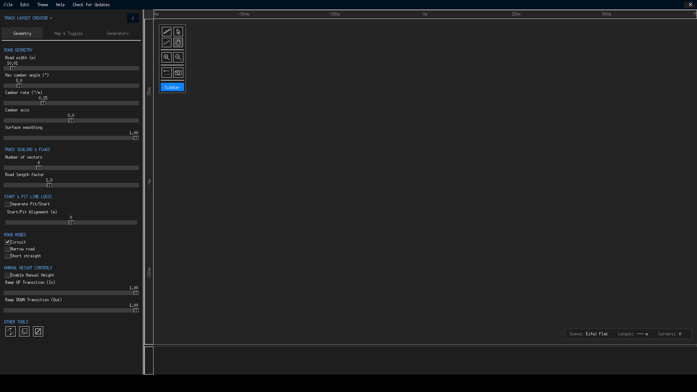
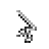
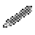
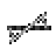
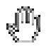
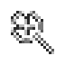
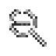
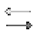
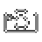

# Toolbar & Canvas Tools

The toolbar floating at the top-left of the canvas is your right hand while editing. Four of its tools — Selection, Pen, Camber and Pan — are *radio tools*: exactly one is active at a time, and each changes what left-clicking, dragging and right-clicking mean. The remaining buttons are one-shot actions. This page explains every tool and gesture, then lists the complete keyboard map.

{ class="tlc-shot" }

## Tool reference

### Selection { #selection }

Selection

The default general-purpose tool. Click a control node to select it (any previous selection is cleared); Shift-click to add or remove nodes from a multi-selection; click empty space to deselect everything. Dragging a selected node translates the whole selection on the canvas, constrained to the X or Y axis if you have armed a constraint (see the ++x++/++y++ keys below).

Right-dragging on a node adjusts its **corner radius** interactively: pull to widen, push to tighten, all the way down to 0 for a sharp corner. The radius cannot drop below half the road width plus a 6 m margin — the point where geometry would break — so the canvas stays constructible at all times.

### Pen { #pen }

Pen

The drawing tool. Left-click empty canvas to append a new control node with sensible defaults (height 0, radius 90 m, camber *global*, one curve segment). Left-click an existing polygon line to **split** it — a new node is inserted exactly where you clicked, perfect for adding a chicane into a long straight. Left-click a node to select it, and — this is the pen's party trick — **Shift-click a node to delete it**.

Dragging moves the selected node(s) just like the selection tool, and right-dragging on a node changes its radius the same way. For track builders who sketch quickly, the pen is the fastest path from imagination to polygon.

### Camber { #camber }

Camber

Select nodes exactly as with the selection tool, then **drag vertically** on a selected node to adjust its banking: the per-point camber angle sweeps from 0° to 30° in 0.01°-per-pixel steps. A node set to −1 (the default) shows `C Global` and follows the automatic global camber rules from the Geometry tab; any other value overrides banking for that corner individually, shown as `C 4.5°` on the node label. See [Track Geometry → Camber](../concepts/track-geometry.md#camber) for how per-point and global camber interact.

### Pan { #pan }

Pan

Left-drag pans the canvas and its rulers. Because right-drag pans in *every* tool, the pan tool mainly matters when you want the left button to never modify geometry — for example while reviewing a layout with a tablet.

### Zoom in / Zoom out { #zoom }

Zoom in Zoom out

Step the zoom by a factor of √2 (≈ ×1.41) per click, clamped between 0.0625× and 16×. These duplicate the ++plus++ / ++minus++ keys and the scroll wheel, which additionally anchor the zoom to the cursor position — usually the more comfortable option.

### Reverse direction { #reverse }

Reverse

Flips the track's direction of travel: the polygon is reversed and the start point rotates by two nodes. Corner numbering, start/pit placement and the elevation profile all recompute to match. Use this when a layout drives better "the other way around" — a surprisingly common realization once elevation is in place.

### Screenshot { #screenshot }

Screenshot

Exports the current canvas as colour PostScript to `img/screen.ps` inside the application folder (the folder is created if missing). This is identical to **File → Export to PostScript**. The isometric viewer has its own export, triggered with ++p++ inside that window.

### Sidebar toggle

The button at the bottom of the toolbar shows or hides the entire left sidebar — handy on small screens when you need the full canvas for a final inspection.

### Rotate / Scale / Randomize { #transform-tools }

These three live at the bottom of the **Geometry** tab under OTHER TOOLS, but they behave like toolbar tools and are listed here for completeness:

- **Equip Rotate Tool** (also ++r++) — drag anywhere on the canvas to rotate the current selection around its centre point.
- **Equip Scale Tool** (also ++s++) — drag to scale the selection up or down around its centre.
- **Randomize Selected Nodes** — displaces every selected node by a random offset of up to ±25 m (clamped to the map edge). A quick "chaos button" for breaking too-regular layouts.

!!! warning "Experimental mirroring"
    X/Y mirror transforms exist in the codebase but are not exposed in the v1.2.0 user interface. The ++x++/++y++ keys arm *axis constraints* for dragging, not mirroring.

---

## Complete keyboard & mouse reference

This is the same reference card available in-app via **Help → Controls**. Bindings marked "any tool" work no matter which radio tool is active.

### Mouse

| Input | Action |
|---|---|
| **Left-click** | Select node / place node (Pen) |
| **Left-drag** | Move selected node(s); rotate/scale when those tools are armed |
| **Shift + Left-click** | Add/remove node from selection; delete node (Pen) |
| **Double-click** | Open the Edit Point precision dialog |
| **Right-drag** | Pan the view (any tool); adjust node radius (on a node) |
| **Scroll wheel** | Zoom in/out anchored at the cursor |

### Keyboard

| Key | Action |
|---|---|
| ++arrow-up++ ++arrow-down++ ++arrow-left++ ++arrow-right++ | Nudge selected node(s) by 1/zoom metres; with nothing selected, move the start point left/right |
| ++enter++ | Open the Edit Point precision dialog |
| ++delete++ | Delete selected node(s) |
| ++escape++ | Deselect all / cancel rotate & scale tools |
| ++a++ | Select all (toggle) |
| ++c++ | Centre view on the track |
| ++e++ | Toggle Euler ↔ circular curve mode for the selection |
| ++f++ | Flip track direction |
| ++r++ | Equip rotate tool |
| ++s++ | Equip scale tool |
| ++x++ / ++y++ | Toggle X/Y axis constraint for drags |
| ++plus++ / ++minus++ | Zoom in / out |
| ++ctrl+z++ | Undo |
| ++ctrl+y++ | Redo |
| ++ctrl+s++ | Save track (`.trk5`) |
| ++ctrl+o++ | Load track |

### Elevation graph

| Input | Action |
|---|---|
| **Click / drag** | Place the distance cursor; centre the canvas on that point of the track |
| **Right-click** | Clear the distance cursor |

### Isometric viewer

| Input | Action |
|---|---|
| **Left-drag** | Rotate the camera |
| **Right-drag** | Pan |
| **Scroll wheel** | Zoom |
| ++p++ | Export PostScript |
| ++r++ | Reset the view |

---

## Undo and redo

Every mutating action — moving or deleting nodes, editing values, generating tracks, importing files, flipping direction — pushes a full snapshot of the polygon onto the history stack before changing anything. There is **no depth limit**: you can undo an entire editing session step by step with ++ctrl+z++ and replay it forward with ++ctrl+y++. Starting a new edit after undoing clears the redo branch, exactly as in familiar office applications. Note that history covers the *polygon* — sidebar settings like road width are not part of snapshots.

!!! tip "Pen and safety"
    The pen tool refuses to let you paint yourself into a corner: minimum radii are enforced live, and deleting a node with Shift-click while other nodes depend on it simply reconnects the polygon. Combine with unlimited undo and it is genuinely hard to lose work on the canvas.
